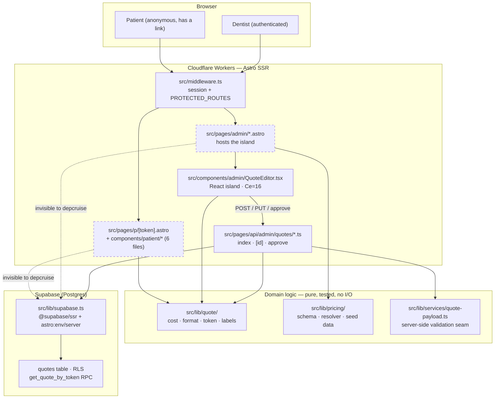

# Repo Map — DentiPlan

> Onboarding document for someone picking this repository up cold.
> Synthesised from three evidence artifacts in this folder:
> [`artifact-1-territory.md`](artifact-1-territory.md) (git history),
> [`artifact-2-structure.md`](artifact-2-structure.md) (dependency graph),
> [`artifact-3-contributors.md`](artifact-3-contributors.md) (authorship).
> It does not restate their tables — it reconciles them and says where they
> disagree.
>
> Last updated: 2026-09-04

## 1. TL;DR

DentiPlan is a single Astro 6 SSR application that turns a dentist's treatment
notes into a priced, patient-readable quote reachable through an unguessable
link. The dentist works in a React island (`QuoteEditor`); the patient sees a
server-rendered `.astro` page at `/p/<token>` and never authenticates. Between
those two sits the one transaction that matters — **approval**, which prices
the quote, snapshots the pricelist, mints the token and freezes the row for
good. Work concentrates almost entirely in the admin editor and the API that
serves it; the pricing and cost engines were written in June and have barely
moved since, and they are also the only well-unit-tested part of the codebase.
The structure is genuinely clean — zero dependency cycles, one type-only layer
violation, no React island touching the database — so refactors stay local.
The catch is that a quarter of the real import graph is invisible to static
analysis, and the invisible quarter is precisely the privacy-sensitive patient
path.

Dashed = the `.astro` layer, which the dependency graph could not read (§7).

## 2. The terrain — where the project actually lives

The directory tree and the activity map do not agree, and the disagreement is
the useful part.

| Zone                                                  | What the tree suggests | What the history and graph say                                                                                             |
| ----------------------------------------------------- | ---------------------- | -------------------------------------------------------------------------------------------------------------------------- |
| `src/components/admin/` + `src/pages/admin/`          | two folders            | **one unit.** Support-4 co-change — the strongest coupling in the repo. They have never moved apart.                       |
| `src/lib/quote/`, `src/lib/pricing/`                  | core domain            | **frozen core.** Written June 2026, barely touched since; carries all 40 unit tests. Deep in importance, shallow in churn. |
| `src/pages/api/`                                      | six sibling endpoints  | **five thin shells and one deep one.** `approve.ts` (Ce=7) composes four modules; the rest are 2–4 edge pass-throughs.     |
| `src/components/patient/`                             | six components         | **structurally invisible.** All `.astro`; 0 recorded edges. Reachable only through e2e.                                    |
| `context/` + `docs/`                                  | documentation          | **a third of all activity.** 47 of 75 commits touch it. This is where the design decisions live, not in anyone's head.     |
| `src/components/ui/`, `Banner.astro`, `Welcome.astro` | components             | vendored shadcn and starter leftovers. Not project code; ignore when reasoning about the domain.                           |

**Activity over time.** The repo has only **five distinct commit days**:
May 24–25 (scaffold + foundation docs), June 3–4 (the product gets built),
September 4 (one slice, then quality tooling). Any "recent activity" reading
is really a reading of three work bursts separated by a five-month gap. That
gap is why the map exists at all.

**Deep vs shallow.** `src/types.ts` is the one true hub (Ca=15, `--reaches`
returns 51 lines) — a healthy shape, but it means no domain-type change is
ever local. `QuoteEditor.tsx` is the deep node on the other axis (Ce=16, 43
edges): nothing imports it, it imports everything. Those two files bracket the
codebase.

## 3. What really changes together

Three couplings, each from a different instrument. The instrument matters,
because the three kinds of coupling cost different amounts to work with.

| Coupling                                                               | Evidence source                                                                                | Kind                                                                 | Cost when you change it                                                                 |
| ---------------------------------------------------------------------- | ---------------------------------------------------------------------------------------------- | -------------------------------------------------------------------- | --------------------------------------------------------------------------------------- |
| `components/admin/` ↔ `pages/admin/`                                   | git co-change, support 4                                                                       | **hand-edited seam** — page serialises a payload, island consumes it | High. A change touching only one side is either trivial or incomplete. Review both.     |
| The `admin/` cluster hubbed on `types.ts`                              | git co-change (support 3 with `QuoteEditor`, 2 with four more) **and** the import graph (Ca=5) | **hand-edited contract** — the two instruments agree                 | High and wide. `admin/types.ts` is the file to read first for any editor work.          |
| `components/admin/` ↔ `pages/api/`, with `approve.ts` spanning 6 areas | git co-change + `--reaches`                                                                    | **wire format, untyped at runtime**                                  | Highest. The editor and the endpoint agree by convention, not by a shared checked type. |
| `scripts/validate-pricing.ts` ↔ `src/lib/pricing/data/`                | git co-change, support 2                                                                       | **guard and guarded** — healthy                                      | Low. Working as designed.                                                               |
| `src/db/database.types.ts` ↔ schema                                    | regeneration, not editing                                                                      | **cheap coupling**                                                   | Low. Regenerated by `supabase gen types`; nobody hand-edits it.                         |

**Two agreements worth trusting.** Git history and the import graph were
derived independently and both land on the same two files: `admin/types.ts`
as the densest local hub, and `approve.ts` as the widest-reaching code file.
The second also matches what `context/foundation/test-plan.md` already named
as risks #1 and #2, written months earlier without either instrument. Three
independent signals pointing at one endpoint is the strongest single finding
in this map.

**One disagreement, and the tree wins.** `CLAUDE.md` tops raw file churn
(14 touches) but 11 of those are solo commits, 9 of them `10x get` package
ingestion. It has near-zero coupling to anything. Anyone ranking hot spots by
touch count on this repo will be misled by it.

## 4. Risk zones

Six areas, worst first. "Why" is one line; the evidence is in the artifacts.

| #   | Zone                                                                          | Why it is risky                                                                                                                                                                                                  |
| --- | ----------------------------------------------------------------------------- | ---------------------------------------------------------------------------------------------------------------------------------------------------------------------------------------------------------------- |
| R1  | **`src/pages/api/admin/quotes/approve.ts`**                                   | The deepest endpoint (Ce=7), composing cost + token + validation + write into one irreversible transaction — and it has no test of its own, only tests of its four ingredients.                                  |
| R2  | **The `/p/<token>` render path** (`p/[token].astro` + `components/patient/*`) | The product's privacy boundary, and 100% invisible to static analysis; what a patient must _not_ see is a product decision that no type enforces.                                                                |
| R3  | **Immutability of an approved quote** (FR-053)                                | Enforced in three places — DB trigger, endpoint guards, UI — and a bug here is unrecoverable by design: the app cannot delete or edit an approved row, so a bad approval is permanent.                           |
| R4  | **`src/lib/supabase.ts` as a chokepoint**                                     | Ten modules depend on it (three of them invisibly); it imports `astro:env/server`, a virtual module that cannot be resolved outside the Astro build — so every dependent is integration-or-e2e only, never unit. |
| R5  | **`src/types.ts` as a single point of change**                                | Ca=15, 51 modules in reach. A schema edit here can break a module no test covers; `astro check` in the pre-commit gate is the only instrument that catches it.                                                   |
| R6  | **The `.astro` blind spot itself**                                            | 48 real import edges (~23% of the graph) are unreadable by dependency-cruiser, so `--reaches` under-reports blast radius by 30% and `config-status.ts` falsely appears to be an orphan.                          |

Two things that are notably _not_ risks, stated because a reader would expect
them to be: there are **zero dependency cycles** in the TS/TSX graph (verified
two ways), and **no React island imports Supabase or server env** — that
boundary holds, and it is what keeps the islands testable at all.

## 5. Who to ask

**Nobody — and that is a finding, not a gap in this map.** `git shortlog -sne
--all` returns exactly one line: 75 of 75 commits by one author. There is no
second contributor for any zone, so a "who to ask" table would be fiction.

Twenty-two of those commits (29%) carry `Co-Authored-By` agent trailers, and
the areas with the _highest_ agent involvement have the _best_ paper trail —
the workflow forced a plan to be written before the code. So the substitute
for a colleague is a document, per zone:

| Zone                               | Read this instead                                                                                                                                      |
| ---------------------------------- | ------------------------------------------------------------------------------------------------------------------------------------------------------ |
| R1 approval / token / patient link | `context/archive/2026-06-04-first-thin-quote-and-patient-link/plan.md` + its two reviews; `test-plan.md` risks #2–#4; `e2e/patient-link-*.spec.ts`     |
| R2 patient render path             | the same slice, plus the two e2e specs — they are the only executable specification of this path                                                       |
| R3 immutability / draft lifecycle  | `context/archive/2026-09-04-admin-quote-list/plan.md` + `reviews/impl-review.md` (finding F1 explains the `useRef` guard and why `useState` was wrong) |
| R4/R5 data contract, types, RLS    | `context/archive/2026-06-03-quotes-data-foundation/plan.md`; `docs/reference/contract-surfaces.md`                                                     |
| Pricing rules                      | `src/lib/pricing/README.md` — an actual written procedure for changing a price                                                                         |
| Runtime, deploy, gates             | `context/deployment/runbook.md`, `deploy-plan.md`, `CLAUDE.md` §Quality gates                                                                          |

The one thing no document can hand over is **credentials and account access**
(Cloudflare token, GitHub repo secrets, the Supabase project). The runbook
names the commands; it cannot grant the access.

## 6. First day — read these, in this order

1. **`context/foundation/prd.md`** — the problem, the persona, and the
   non-goals. Fifteen minutes here saves an afternoon of guessing why the
   product refuses to do obvious things.
2. **`context/foundation/test-plan.md` §2 (Risk Map)** — six named risks. Two
   independent instruments in this map agree with it; treat it as accurate.
3. **`src/types.ts`** — the domain vocabulary and the repo's central hub. Every
   other file assumes you have read it.
4. **`src/pages/api/admin/quotes/approve.ts`** — the one transaction that
   matters, and the highest-risk file in the app. Short; read it whole.
5. **`src/lib/quote/cost.ts`** + `cost.test.ts` — the business logic (standard
   vs. general anaesthesia, automatic removal of local-anaesthesia items, price
   ranges) and its tests. This is what the product is actually _for_.
6. **`src/components/admin/types.ts`** — the editor island's local contract and
   the hub of the densest cluster in the codebase.
7. **`src/pages/p/[token].astro`** — the patient side, and the start of the
   region no static tool can see.
8. **`context/archive/2026-09-04-admin-quote-list/plan.md`** — the most recent
   completed slice, with the fullest plan-and-review trail. It shows how work
   is done here.

## 7. Limits — what this map does not tell you

- **Time window: the whole history, 2026-05-24 → 2026-09-04.** The lesson's
  12-month frame was dropped as meaningless here; the project is 104 days old
  and has five active days. "Quarterly" became three work bursts.
- **A quarter of the import graph was never read.** dependency-cruiser cannot
  parse `.astro`; the 21 `.astro` files appear in the graph as nodes with zero
  edges. That is `unknown`, **not** "no dependencies" — 48 real edges were
  recovered by hand with `grep` and are listed in artifact 2 §2. Any
  `--reaches` query on this repo must be paired with
  `grep -rl "<module>" src --include='*.astro'`.
- **The instrument that does see `.astro` is `astro check`**, which already
  runs at the pre-commit gate. No second tool is recommended.
- **`npm run depcruise` currently exits non-zero** on the one type-only layer
  violation (`lib/pricing/picker-options.ts → components/admin/types.ts`). It
  is deliberately not wired into CI until that is fixed.
- **Nothing here measures runtime behaviour, SQL, or RLS.** The migrations and
  policies in `supabase/` are outside every instrument used: no import graph
  covers them, and their co-change signal is weak (11 commits). The DB-side
  guarantees are documented in the slice plans, not derivable from this map.
- **Co-change is not causation.** Support counts of 2–4 on a 75-commit history
  are directional, not statistical. Treat them as "look here", not as proof.
- **This is a map of activity and structure, not of correctness.** It says
  where change is expensive and where the instruments are blind. It says
  nothing about whether the code is right.
